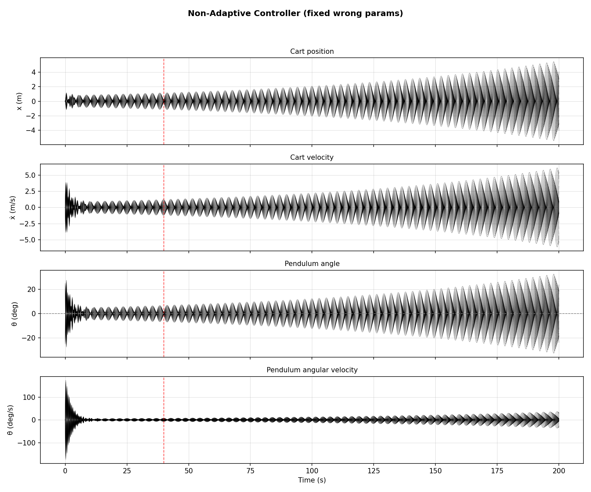
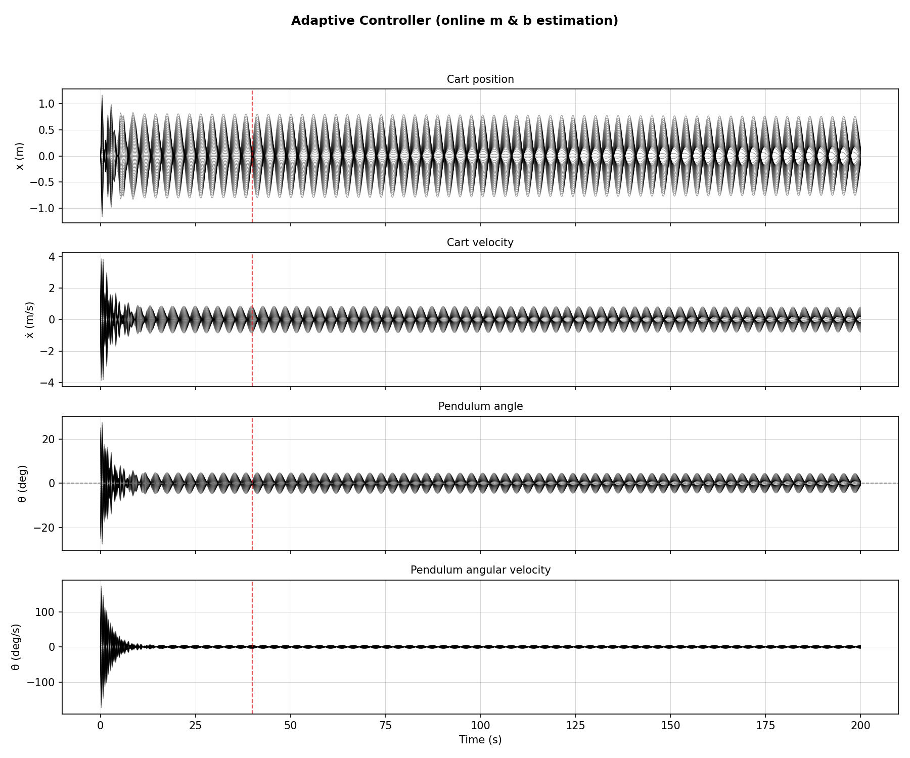
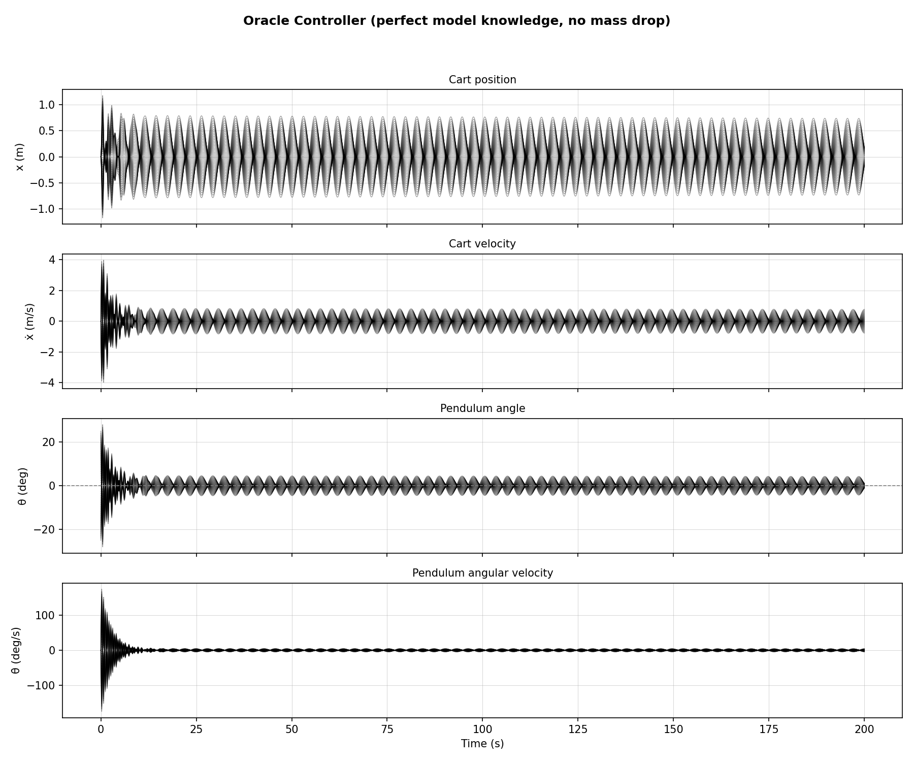
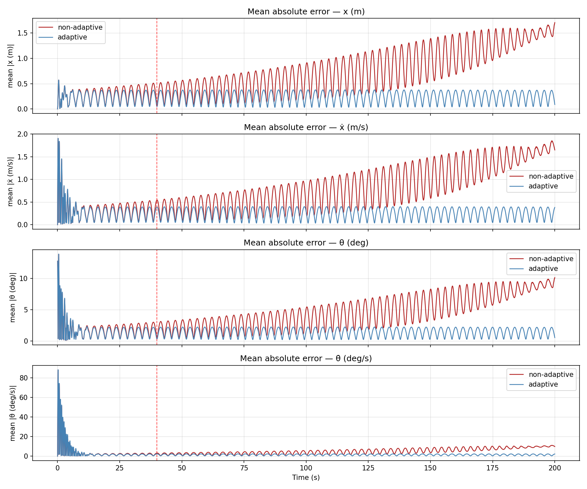
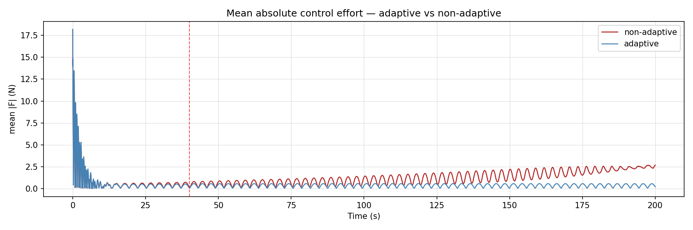
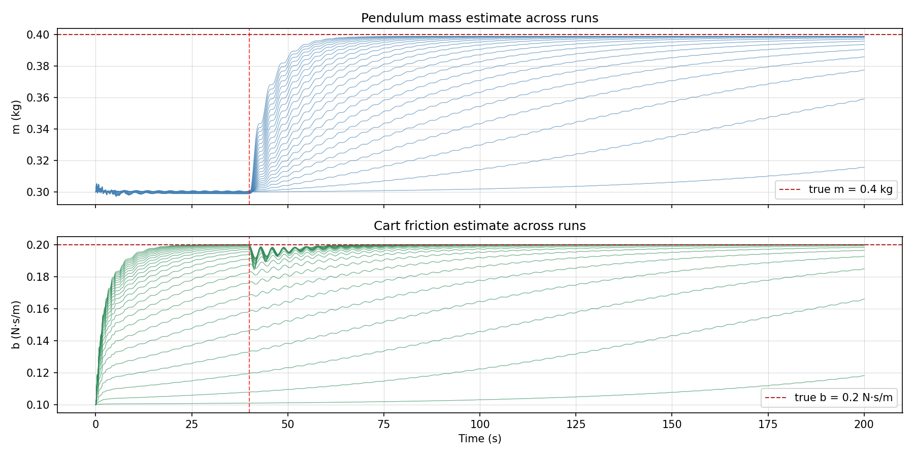

# Adaptive Control for an Inverted Pendulum

A nonlinear model-based controller for a cart-pendulum system, extended with online parameter adaptation to handle unknown or changing system dynamics.

---

## System

A pendulum mounted on a cart. The state vector is:

```
[x, x_dot, theta, theta_dot]
```

- `x` — cart position (m)
- `theta` — pendulum angle from upright vertical (rad), `theta=0` is straight up
- Mass `M` (cart), `m` (pendulum), rod length `L`, gravity `g`, cart friction `b`

The full nonlinear equations of motion are derived from the Lagrangian and integrated with RK4.

---

## Controllers

### Lyapunov-Based Controller (Baseline)

A nonlinear model-based control law derived from Lyapunov stability analysis:

```
u = [(M+m)g / cos(θ)] sin(θ)
  + [(M+m)L / cos(θ)] (k·θ + p·θ̇ + c·k·x + c·p·ẋ)
  + mL·θ̈_est·cos(θ)
  - mL·θ̇²·sin(θ)
  + b·ẋ
```

Where `k`, `p` are proportional/derivative gains on the angle, and `c` (`--cart-weight`) adds a restoring force on cart position. Control output is saturated at ±50 N.

This controller uses a fixed internal model — if the true system parameters differ from its belief, there is a persistent model mismatch.

### Adaptive Controller (MRAC-style)

Extends the Lyapunov controller with online gradient-descent adaptation of the pendulum mass `m` and cart friction `b`.

**Key idea:** The x-equation of motion is linear in `m` and `b`:

```
m·φ₁ + b·ẋ = u - M·ẍ
φ₁ = ẍ + L·cos(θ)·θ̈ - L·θ̇²·sin(θ)
```

At each timestep the controller computes a prediction error `ε` and updates:

```
m_hat -= γ_m · ε · φ₁ / norm · dt
b_hat -= γ_b · ε · ẋ   / norm · dt
norm   = φ₁² + ẋ² + 1
```

The normalization keeps updates bounded regardless of excitation magnitude. Both `ẍ` and `θ̈` are estimated via finite difference.

**Limitation:** Near the upright equilibrium `φ₁ → 0` and `ẋ → 0`, so adaptation naturally freezes once the system is stabilized. Mass identification requires the pendulum to be away from vertical (persistent excitation condition).

---

## Experiments

### Mass Disturbance

At `t = 40s` an extra mass `--delta-m` is added to the pendulum bob. The controller is not told about this — it must either tolerate the mismatch (non-adaptive) or recover by updating its estimates (adaptive).

True system parameters:
- `m = 0.3 kg` initial, jumps by `delta_m` at `t = 40s`
- `b = 0.2 N·s/m` (true friction)

Controller's initial belief:
- `m = 0.3 kg` (correct initially, wrong after drop)
- `b = 0.1 N·s/m` (underestimates friction throughout)

---

## Results

All plots are saved to `results/`.

### State Trajectories

Each line is one Monte Carlo trial. The red dashed line marks the mass drop at `t = 40s`.

| File | Description |
|---|---|
| `monte_carlo_states_nominal.png` | Non-adaptive controller — fixed wrong params after mass drop |
| `monte_carlo_states_adaptive.png` | Adaptive controller — updates `m_hat` and `b_hat` online |
| `monte_carlo_states_oracle.png` | Perfect-knowledge controller, no mass drop (upper bound baseline) |





### Mean Absolute Error Comparison

Mean `|state|` across all runs over time. A well-functioning adaptive controller shows lower error than the non-adaptive one after the mass drop.



### Control Effort Comparison

Mean `|F|` (applied force) across all runs. Shows how hard each controller is working to maintain stability after the disturbance.



### Parameter Estimates

`m_hat` and `b_hat` over time for each run in the adaptive case. The dashed red line shows the true value post-drop. Convergence toward the true value indicates successful adaptation.



---

## Usage

### Animation (single run)

```bash
# Adaptive controller (default)
python animate.py

# Non-adaptive — fixed wrong params, mass drop applied
python animate.py --mode nominal

# Oracle — perfect model knowledge, no mass drop
python animate.py --mode oracle

# Custom initial angle
python animate.py --mode adaptive --theta0 -20
```

### Monte Carlo

```bash
python run_monte_carlo.py
```

### Key arguments

| Argument | Default | Description |
|---|---|---|
| `-k` | 50.0 | Proportional gain on θ |
| `-p` | 1.0 | Derivative gain on θ̇ |
| `--cart-weight` | 0.1 | Restoring gain on cart position/velocity |
| `--delta-m` | 0.1 | Mass added to pendulum at `t_drop` (kg) |
| `--t-drop` | 40.0 | Time of mass increase (s) |
| `--gamma-m` | 1.0 | Learning rate for mass adaptation |
| `--gamma-b` | 1.0 | Learning rate for friction adaptation |
| `--runs` | 50 | Number of Monte Carlo trials |

---

## File Structure

```
├── animate.py               # Single run animation — nominal, adaptive, or oracle mode
├── run_monte_carlo.py       # Monte Carlo sweep with comparison mode
├── simulation/
│   ├── dynamics.py          # CartPendulum — full nonlinear EOM, RK4 integrator
│   ├── controller.py        # Lyapunov control law, ParameterEstimator, finite-difference estimators
│   └── visualize.py         # Plotting and animation utilities
└── results/                 # Output figures
```
